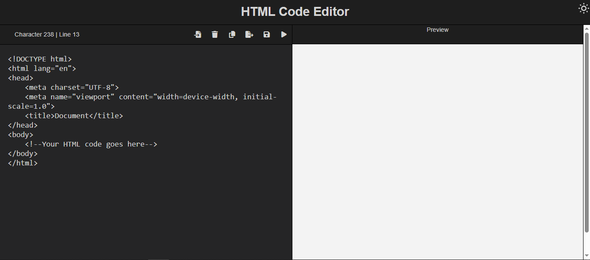

# Code Editor

A lightweight, browser-based code editor with real-time editing capabilities.

## 🚀 Features

- **Real-time Preview** - Instant HTML rendering with debounced updates
- **Save/Load Functionality** - Persist your code using localStorage
- **Import/Export** - Download your edited code as HTML files
- **Copy to Clipboard** - Quick copy functionality for code snippets
- **Character & Line Counter** - Track your code metrics in real-time
- **Theme Toggle** - Switch between light and dark modes
- **Notification System** - User-friendly feedback for all actions
- **Responsive Design** - Optimized for tablets and desktop (768px+)

## 💡 Key Technical Challenges

The primary challenge was implementing smooth real-time preview updates without performance degradation. I solved this using a debounced rendering approach that delays the preview update until the user stops typing for 300ms, preventing excessive DOM re-renders. Additionally, managing state persistence with localStorage while handling import/export operations required careful coordination between the file system API and browser storage.

## 🛠️ Technologies Used

- HTML5
- CSS3
- JavaScript (Vanilla)

## 🎯 What I Learned

Building this project deepened my understanding of DOM manipulation, event handling, and code parsing. I learned how to structure a project for maintainability and gained insights into the complexities of implementing IDE-like features from scratch.

## 📦 Installation & Setup

1. Clone the repository
2. Open index.html in your browser

## 🔗 Live Demo

[Link to GitHub Pages deployment](https://hardextech.github.io/codeEditor/)

## 📄 License

This project is open source and available under the [MIT License](LICENSE).

## 👤 Author

**Adesina Ayomide Emmanuel**

- GitHub: [@HarDexTech](https://github.com/HarDexTech)
- LinkedIn: [hardextech](https://linkedin.com/in/hardextech)
